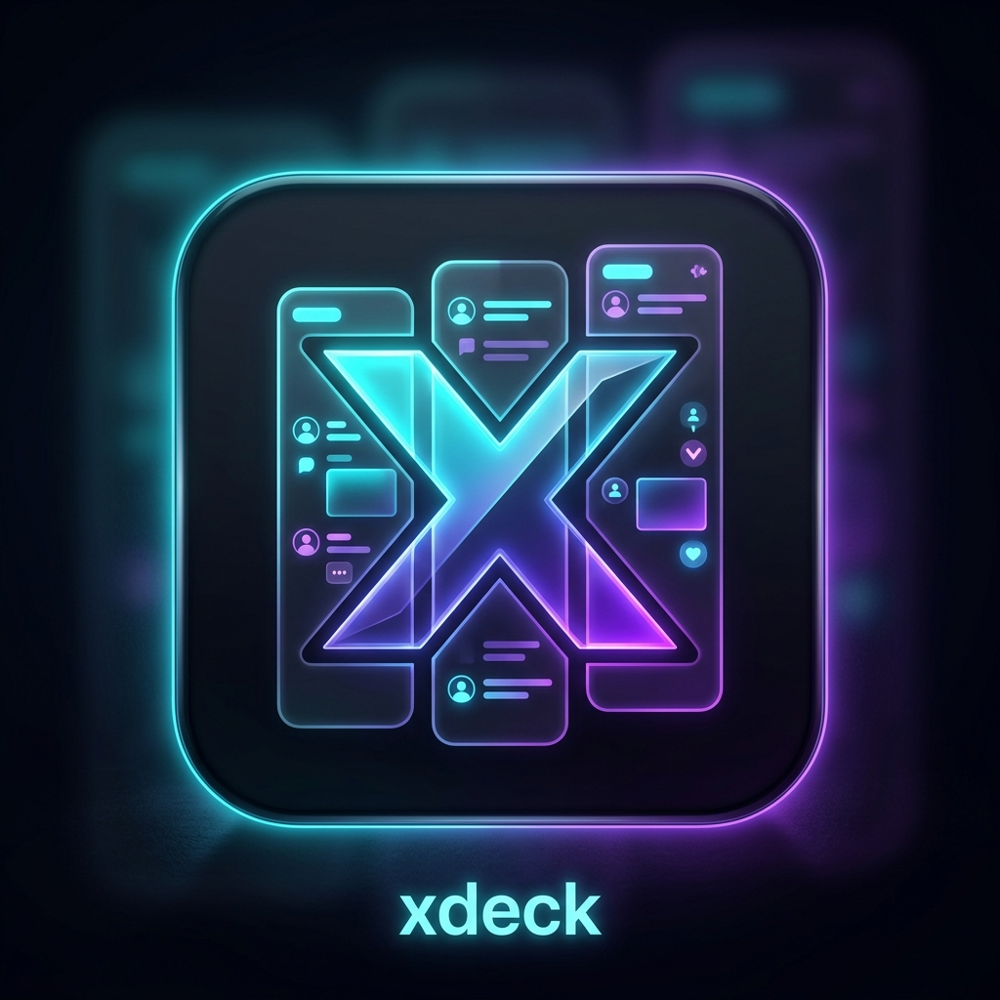

<div align="center">
  
  <h1>XDeck DIY</h1>
  <p><strong>A Lightweight, Free, Multi-Column Desktop Client for X (Twitter) — The Ultimate TweetDeck / X Pro Alternative</strong></p>
  <p>
    <a href="#english">English</a> | <a href="#简体中文">简体中文</a>
  </p>
</div>

<div align="center">

### 📥 [下载最新版 · Download Latest Release](https://github.com/hjinhao066/xdeck-diy/releases/latest)

 **macOS** (Apple Silicon · `.dmg`)　·　🪟 **Windows** (`.exe`)

🤖 **AI 助手一键安装 · One-click install via an AI agent**
把这句发给 Claude Code / Cursor — *paste this to your coding agent:*
> Clone `https://github.com/hjinhao066/xdeck-diy`, run `npm install`, then `npm start`.

<sub> macOS 首次打开:应用未做付费签名,**右键 →「打开」**一次即可 · *On first launch, right-click the app → **Open**.*</sub>

</div>

---

<a name="english"></a>
## English

XDeck DIY is a cross-platform (Windows & macOS) desktop client that brings back the classic multi-column TweetDeck experience for free, without relying on paid X APIs. It works by running multiple secure, sandboxed webview containers side-by-side, sharing a single login state.

### 🌟 Why XDeck DIY?
Since X Pro (formerly TweetDeck) is now paywalled under X Premium+ ($40/month) and third-party API clients are restricted, XDeck DIY provides a secure, fully compliant, and free alternative:
- **TOS Compliant & Safe**: No web scraping, no third-party API calls. It renders the official, secure `x.com` pages directly, keeping your account safe from automated bot flags.
- **Single Sign-On (SSO)**: All columns share the same persistent session. Log in once in any column, and all other columns (Home, Lists, Notifications, Bookmarks) are automatically logged in.
- **Local Persistence**: Layouts, column widths, orders, and dark/light modes are saved locally in a JSON file, ensuring settings are never lost.

### 🛠️ Key Features
- 👥 **Multi-Account & Multi-Window**: Add multiple X accounts, each with a fully independent login session. Switch accounts inside a window, or open several windows (one account each) side by side — completely isolated, each remembering its own deck layout.
- 🧩 **Custom Column Configuration**: Add any `x.com` link (Lists, Bookmarks, Search Queries, Profiles, notifications) as a new column.
- ↔️ **Draggable Resizing**: Drag the edge of any column to customize width (240px - 900px), with automatic width memory.
- ↔️ **Quick Reordering**: Shift columns left or right with simple arrow controls without reloading their active states.
- 🧭 **Built-in Navigation Control**:
  - **Header Back/Forward Buttons**: Seamlessly go back or forward in history on individual columns (ideal for Grok pages, search sub-links, and profile drill-downs).
  - **Mouse Side Button Support**: Full compatibility with mouse side back/forward buttons (X1/X2) on hovered columns.
  - **Two-finger Swipe**: Swipe left/right inside a column to go back/forward.
- 🖼️ **Right-click Image Menu**: Copy or save images, copy image / link address.
- 🌙 **Theme Memory**: Easily switch between X "lights out" dark mode and clean Apple light gray style, remembering your choice.
- 📦 **Cross-Platform**: Compiled installers and standalone binaries for both Windows and macOS.

### 🚀 Installation & Running

#### Prerequisite
Make sure you have [Node.js](https://nodejs.org) installed on your system.

#### Clone and Run
```bash
# Clone the repository
git clone https://github.com/hjinhao066/xdeck-diy.git

# Navigate to directory
cd xdeck-diy

# Install dependencies
npm install

# Start the application
npm start
```

### 📦 Building & Packaging
Compile standalone binaries and setups on your native operating system:
```bash
# Pack for Windows (generates .exe installer & portable unpacked version in dist/)
npm run dist:win

# Pack for macOS (generates .dmg in dist/)
npm run dist:mac
```
> *Note: Windows builds must be compiled on Windows, and macOS builds must be compiled on macOS to avoid cross-compilation dependency issues.*

---

<a name="简体中文"></a>
## 简体中文

XDeck DIY 是一款基于 Electron 开发的跨平台（Windows & macOS）桌面客户端。它在不依赖任何第三方 X API 的情况下，为您提供完全免费的多列 TweetDeck 布局体验。通过多窗口并排渲染真实的 `x.com` 网页并共享相同的 Cookie 会话，实现轻量、安全的流媒体监控。

### 🌟 为什么选择 XDeck DIY？
随着 X Pro (原 TweetDeck) 成为 Premium+ 会员（约 $40/月）的专属功能，且第三方 API 接口被严格封禁，XDeck DIY 提供了一个安全且免费的替代方案：
- **安全合规，无封号风险**：不进行网络爬虫，不调用任何 API 接口。它直接加载 X 官方的原生网页，安全性与标准浏览器完全一致。
- **共享登录态**：所有列容器共享同一个持久化会话。在任意一列中完成一次 X 账号登录，所有卡片（主页、列表、书签、通知等）即可全部同步登录。
- **本地化数据持久性**：所有卡片列的排序、独立宽度、主题和排列，都会即时安全地保存到本地 JSON 配置文件中，重开软件绝不丢失配置。

### 🛠️ 功能特性
- 👥 **多账号 / 多窗口**：可添加多个 X 账号，每个账号拥有**完全独立的登录会话**（cookie 互不干扰）。可在同一窗口内切换账号，也可为每个账号各开一个窗口并排使用——彼此隔离、各自记住自己的列布局。
- 🧩 **自由扩展列**：支持添加任意 `x.com` 链接（列表 List、书签 Bookmarks、特定账号、实时搜索、通知等）。
- ↔️ **列宽自由拖拽**：鼠标拖拽列边缘即可随意调节列宽（240px - 900px），支持自动记忆。
- ↔️ **快速排序**：支持卡片列无刷新地左右平移调整顺序，保持当前页面的浏览状态不中断。
- 🧭 **内置导航控制**：
  - **列顶栏历史导航**：在每列头部集成了“后退”与“前进”按钮，支持状态自动禁用，能完美解决 Grok 页面或子帖子中无法返回的问题。
  - **鼠标侧键兼容**：深度适配鼠标侧键，悬停在任意列上点击侧键即可直接控制该列内容的前进与后退。
  - **两指滑动**：在列内两指左右滑动即可后退 / 前进。
- 🖼️ **图片右键菜单**：复制 / 保存图片、复制图片或链接地址。
- 🌙 **主题记忆**：一键切换 X 原生深色模式与苹果极简浅灰模式，并在本地记住您的喜好。
- 📦 **跨平台支持**：提供 Windows 及 macOS 的一键安装包和免安装绿色版程序。

### 🚀 快速上手

#### 前置条件
确保您的系统已经安装了 [Node.js](https://nodejs.org)。

#### 拉取并运行
```bash
# 克隆代码仓库
git clone https://github.com/hjinhao066/xdeck-diy.git

# 进入项目目录
cd xdeck-diy

# 安装依赖
npm install

# 启动软件
npm start
```

### 📦 打包指南
在对应系统的终端下运行打包脚本，即可生成独立的可执行程序：
```bash
# 打包 Windows 版本（在 dist/ 下生成一键安装包 .exe 和免安装绿色版）
npm run dist:win

# 打包 macOS 版本（在 dist/ 下生成 .dmg 安装包）
npm run dist:mac
```
> *注意：由于跨平台打包容易产生平台依赖冲突，请在 Windows 系统上打包 Windows 版本，在 macOS 系统上打包 Mac 版本。*
